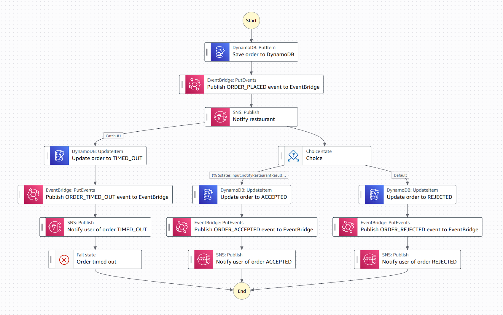

# Order Processing with AWS Step Functions



## Workflow Overview

This Step Functions state machine orchestrates the complete order processing lifecycle from placement to final status notification.

### Flow Steps

1. **Save order to DynamoDB** - Store order with `PLACED` status
2. **Publish ORDER_PLACED event** - Emit event to EventBridge for downstream processing
3. **Notify restaurant** - Send SNS notification and wait for restaurant response
4. **Choice** - Branch based on restaurant response (`isAccepted: true/false`)
5. **Update order status** - Set to `ACCEPTED`, `REJECTED`, or `TIMED_OUT`
6. **Publish status event** - Emit corresponding EventBridge event
7. **Notify user** - Send final status notification via SNS

### Possible Outcomes

- **✅ ACCEPTED** - Restaurant confirms order → User gets "Order confirmed"
- **❌ REJECTED** - Restaurant declines order → User gets "Order declined"
- **⏰ TIMED_OUT** - No response within 5 seconds → User gets "Order expired"

## waitForTaskToken Pattern

The **"Notify restaurant"** state uses the callback pattern with `waitForTaskToken`:

```json
"Resource": "arn:aws:states:::sns:publish.waitForTaskToken"
```

### How It Works

1. **SNS Message Sent** - Contains `task_token` for callback
2. **Execution Pauses** - Step Functions waits for external response
3. **Restaurant Responds** - Must call AWS CLI with task token:

```bash
# Accept order
aws stepfunctions send-task-success \
  --task-output '{"isAccepted": true}' \
  --task-token "AQCQAAAAKgAAAAMAAAAA..."

# Reject order
aws stepfunctions send-task-success \
  --task-output '{"isAccepted": false}' \
  --task-token "AQCQAAAAKgAAAAMAAAAA..."

# System failure
aws stepfunctions send-task-failure \
  --error "RestaurantUnavailable" \
  --cause "Restaurant system is down" \
  --task-token "AQCQAAAAKgAAAAMAAAAA..."
```

4. **Execution Resumes** - Continues to Choice state with response data

### Task Output Mapping

The `--task-output` becomes `$states.result` and maps to `notifyRestaurantResult`:

```json
"Output": {
  "order_id": "",
  "notifyRestaurantResult": ""
}
```

**Result:** Next state receives `{"order_id": "123", "notifyRestaurantResult": {"isAccepted": true/false}}`

### Timeout Handling

- **Timeout**: 600 seconds (`TimeoutSeconds: 600`)
- **On Timeout**: Catches `States.Timeout` error → Updates order to `TIMED_OUT`
- **User Notification**: "Order expired" message sent via SNS

### Response Types

**Business Outcomes** (use `send-task-success`):
- Restaurant accepts/rejects order → `{"isAccepted": true/false}`
- Both acceptance and rejection are valid business responses

**Technical Failures** (use `send-task-failure`):
- Restaurant system crashes → Error details with `--error` and `--cause`
- Network issues, authentication failures, etc.

**Key Principle**: Business decisions use `send-task-success` regardless of the decision outcome. Only technical/system failures use `send-task-failure`.

This callback pattern enables human-in-the-loop approval workflows where external systems must respond before processing continues.
